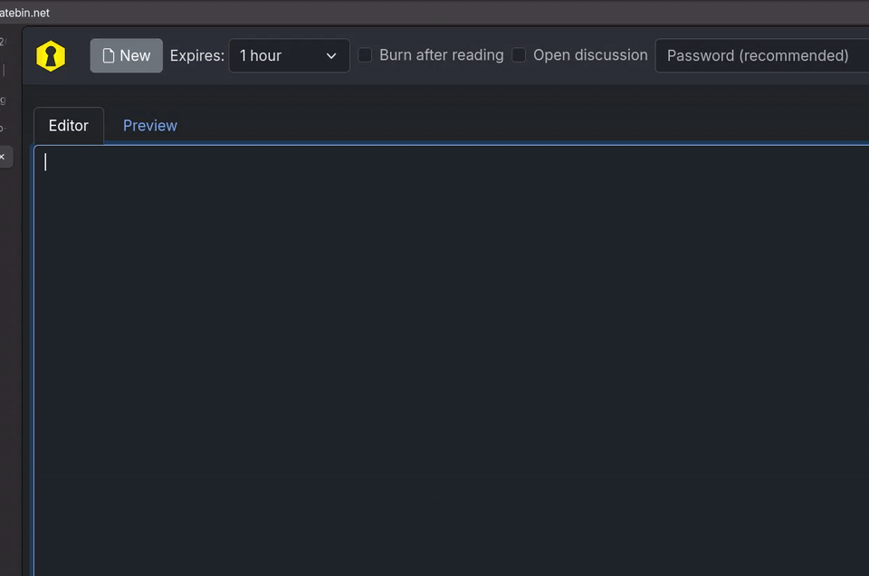
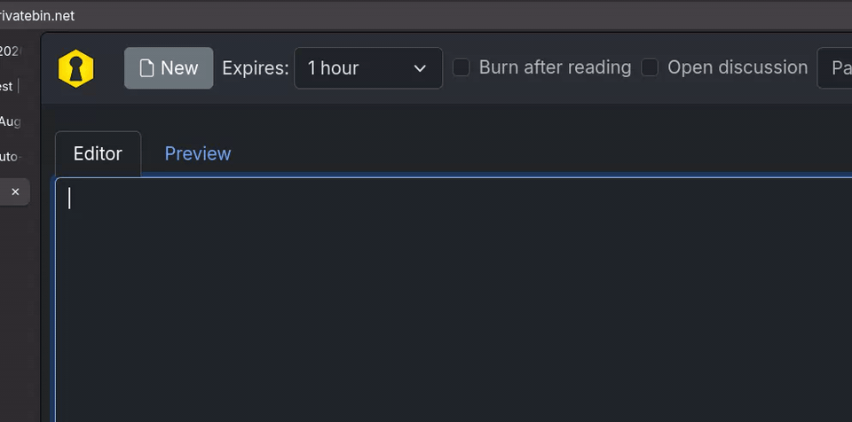

# ibus-proofread

A local auto-correction demo using **unsloth/Gemma-4-E2B-it Q4_K_M**, llama.cpp with Vulkan, and an **800 ms typing debounce**. It includes a standalone GTK sandbox and a temporary IBus input method for GNOME/Wayland.



## Quick start

Requires **x86_64 Linux**, Nix with flakes enabled, and a graphical session. The IBus mode additionally needs a running IBus daemon and an application using IBus (for example GNOME/Wayland). The first launch downloads an approximately 3.1 GB model; a Vulkan-capable GPU is recommended.

Try the standalone sandbox without cloning, inside your graphical session:

```sh
nix run github:nilsherzig/ibus-proofread -- demo
```

For automatic correction in IBus-enabled applications, with decision logs:

```sh
nix run github:nilsherzig/ibus-proofread -- ibus --verbose
```

**This is an experimental auto-corrector that can change your text incorrectly.** Try the sandbox before enabling it in other applications.

## Try the sandbox from a checkout

```sh
git clone https://github.com/nilsherzig/ibus-proofread.git
cd ibus-proofread
nix run . -- demo
```

Type `Ich habe dise Nachicht geschriben.` and pause. After 800 ms without changes, local inference starts. Its runtime is added to that delay. The corrected text replaces the editor contents automatically, with no preview or confirmation. **Escape** cancels a pending check. Closing the window stops the owned inference server.

The sandbox checks its entire editor contents, up to 1200 characters. Cursor changes reschedule checking; leaving the editor discards outstanding results. Applying a correction does not schedule another check of the same text.

## Try the IBus input method

```sh
nix run . -- ibus
```

Wait for the `Demo engine active` log message, then focus an editable field in an application using IBus. The engine is registered and activated for this process's lifetime; it does not install a persistent GNOME input source or change your saved input-source settings. GNOME input-source switching can switch away from the demo.

- Printable characters and spaces build an underlined **preedit composition**.
- After an 800 ms pause and local inference, the correction is committed automatically. Unchanged results also commit the original composition.
- There is no candidate popup, preview or Tab confirmation.
- **Enter**, **Tab** and **Escape** before completion commit the original composition, cancel its pending correction and pass the key to the application.
- **Backspace** edits the composition. Printable punctuation stays in the composition. Modifier keys alone (Shift, Caps Lock, AltGr, Control, etc.) pass through without committing it. Actual navigation and modifier shortcuts commit the original before passing through.
- Focus loss asks the application to commit original preedit and invalidates outstanding corrections.
- URL, email, digits, number, phone, terminal, password and PIN fields bypass the engine when reported by the application.
- The `no-spellcheck`, `private` and `hidden-text` hints also bypass the engine. A word-completion hint alone does not disable proofreading: it does not reliably identify live autocomplete fields.
- Switching an existing composition to a nonsensitive excluded field commits its original text and cancels pending corrections. Sensitive fields clear the composition. Returning to a normal field enables proofreading again.

Stop with **Ctrl+C in the launching terminal**. On normal shutdown, the previous IBus engine is restored if the demo is still active. A forced kill cannot run that cleanup; switch to your normal input source if necessary.

This is a composition-based demo, not an editor for previously committed or selected text. The simple engine has no dead-key composition support. Application integration depends on IBus/preedit support; the isolated D-Bus path is tested, but this does not establish compatibility with every GNOME application or browser field.

## Surrounding text as context

The IBus engine requests surrounding-text updates from the application. It sends up to **400 characters before and 400 after** the cursor/selection alongside the current composition. Selection contents are excluded from that context. The prompt asks Gemma to use this only for interpreting the composition and deciding spacing/punctuation; only the current composition is committed as replacement text. The engine never deletes or rewrites surrounding text.

Context or cursor/selection changes invalidate pending results and restart the debounce for a nonempty composition. Focus loss clears cached context. Excluded fields ignore context updates entirely. Applications without surrounding-text support still work, but supply no additional context. The standalone sandbox does not have an external surrounding-text source.

## Custom prompts

`--prompt` replaces the proofreading task with any text transformation. It works in every mode. The default task is [`example_prompts/proofread.txt`](example_prompts/proofread.txt); [`example_prompts/translate.txt`](example_prompts/translate.txt) translates into English:



```sh
nix run . -- demo --prompt "$(cat example_prompts/translate.txt)"
nix run . -- ibus --prompt "$(cat example_prompts/translate.txt)"
printf 'hey kannst du mir morgen das dokument schicken' | nix run . -- check --prompt "Rewrite the text in a formal, polite tone. Keep its language."
```

The prompt only describes the task. Fixed rules are always appended: the input format, read-only use of surrounding context, boundary whitespace, treating input as data and returning only the replacement text. Debounce, field exclusions and automatic application are the same for every prompt. In IBus mode each composition is transformed separately, so pausing mid-sentence transforms that fragment on its own.

## Decision logging

Logs appear in the launching terminal on stderr. Every field-entry event logs its reported purpose/hints or explicitly `type missing (not reported yet)`; later type reports are logged as updates. Normal logging includes field purpose/hints, proofreading versus bypass decisions, inference start/completion/duration, stale-result rejection, composition commits and server lifecycle. For per-key bypass decisions, context/cursor metadata and debounce scheduling/invalidation details:

```sh
nix run . -- ibus --verbose
# The sandbox supports verbose logs too:
nix run . -- demo --verbose
```

For example, an application reporting a URL field produces `Field purpose=url hints=none: BYPASS`; a normal field produces `proofreading enabled`. Logs contain metadata such as character counts and version numbers, not typed text, generated corrections, key characters or the server API key. If a browser reports its address bar as `free-form`, the logs make that limitation visible; the engine cannot infer unreported field semantics.

## Model and inference

The first launch downloads the text GGUF (approximately 3.1 GB) from:

- Repository: `unsloth/gemma-4-E2B-it-GGUF`
- Revision: `0314792d7f1f7e229411f620751375812bb9faf2`
- File: `gemma-4-E2B-it-Q4_K_M.gguf`

It is cached under `${XDG_DATA_HOME:-~/.local/share}/ibus-proofread/REVISION/`. Downloads are atomic. No vision/audio projector is needed for this text-only demo. The Nix flake pins dependencies, including a Vulkan-enabled llama.cpp. GPU offload is requested; llama.cpp may fall back to CPU on other hardware.

Each launch owns one loopback-only server with a random API key. Typed text is sent only to that local server; it is not uploaded to Hugging Face. Server diagnostics use a temporary log, removed on shutdown. **Corrections are applied automatically and can contain model mistakes.** The default prompt explicitly requests spelling, punctuation and uppercase/lowercase corrections, including German noun/sentence capitalization and incorrectly capitalized verbs/adjectives.

Boundary whitespace is significant. Gemma uses context to distinguish sentence starts from word/sentence continuations. Existing leading/trailing whitespace is preserved by the inference client even if the model omits it; model-added separators remain intact when none existed. When the context before ends with `.`, `!` or `?` without a separator and the replacement starts with an uppercase letter, the client adds the separating space itself, because small models drop it unreliably. Previously committed context is never changed.

Only one inference runs at a time, with at most one latest debounced request queued. Text changes and focus loss invalidate older results. Inference failures preserve the original text.

Other commands:

```sh
nix run . -- download
printf 'Ich habe dise Nachicht geschriben.' | nix run . -- check
printf 'Guten Morgen!' | nix run . -- check --prompt "$(cat example_prompts/translate.txt)"
nix run . -- demo --model /path/to/model.gguf
nix run . -- --help
```

## Tests

```sh
nix develop --command python tests/run.py
# Include real model/GPU inference in the GTK test:
PROOFREAD_TEST_MODEL=1 nix develop --command python tests/run.py
```

The runner owns a virtual X display and a private session bus/IBus daemon. It does not inject keys into the real desktop. Tests cover debounce replacement, stale-result invalidation including context changes, bounded queuing, failures, metadata-only logs, boundary-whitespace preservation, GTK automatic replacement/cancellation, and real IBus activation/automatic commits/field exclusions/surrounding-text delivery, and physical modifier sequences for punctuation/capital letters versus actual shortcuts and navigation. The real-model test checks spelling, German capitalization, sentence-boundary spacing and translation into English. The real-model test expects the cached default GGUF; run `download` first.

## Flow

```text
composition or context changed:
    invalidate outstanding results
    restart the 800 ms timer

timer fires:
    send a versioned composition + read-only context snapshot to local inference off the UI thread

result arrives:
    if snapshot is still current:
        automatically commit/apply the correction without a preview
    otherwise:
        discard it
```
